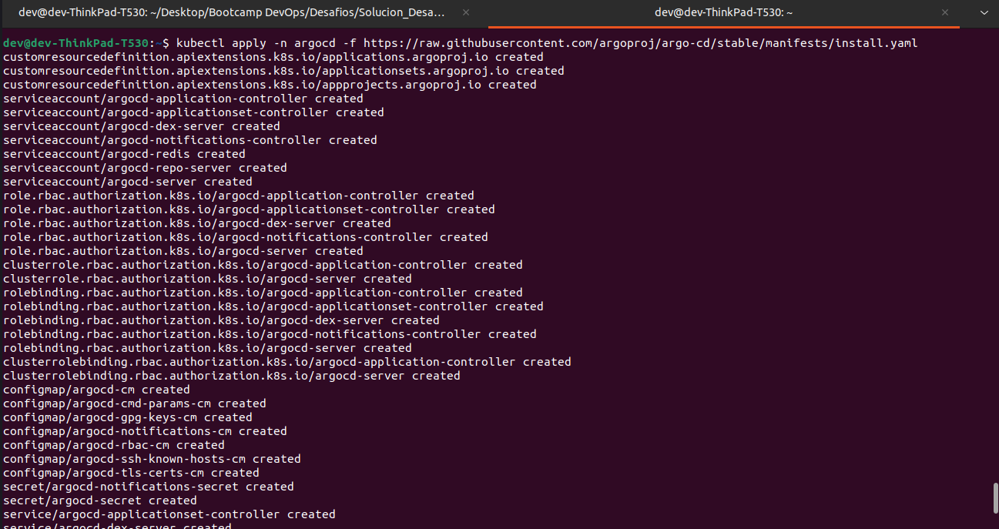
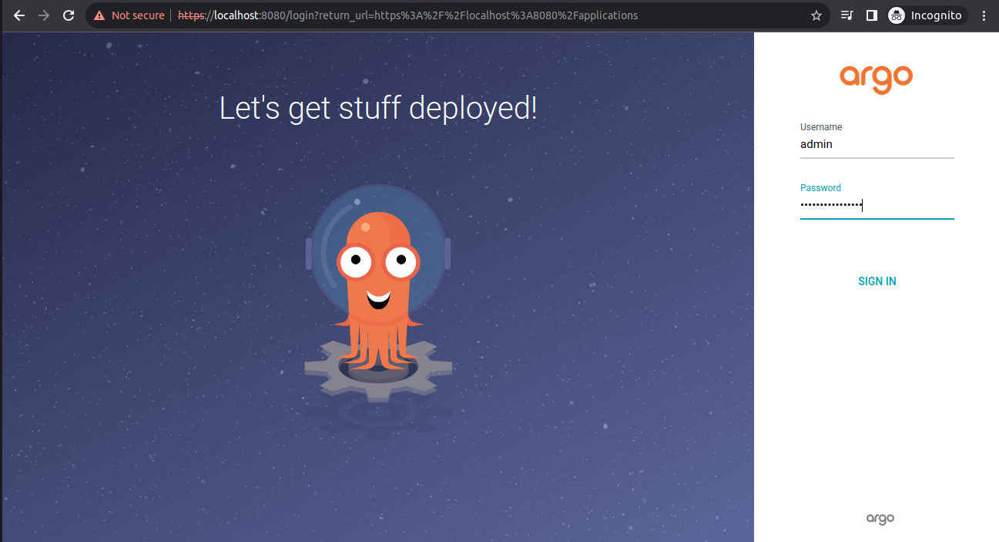
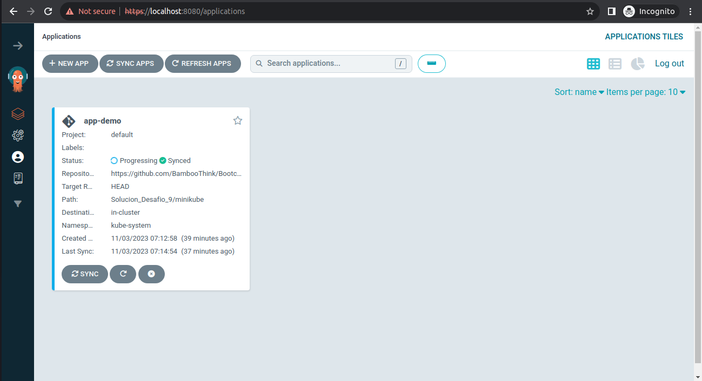
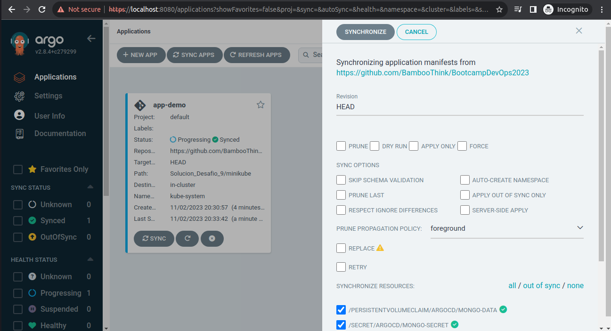
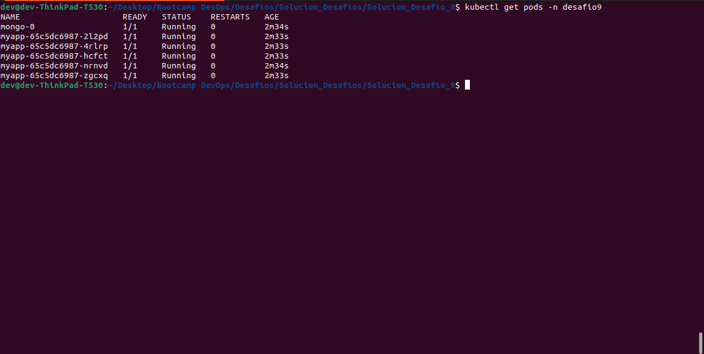
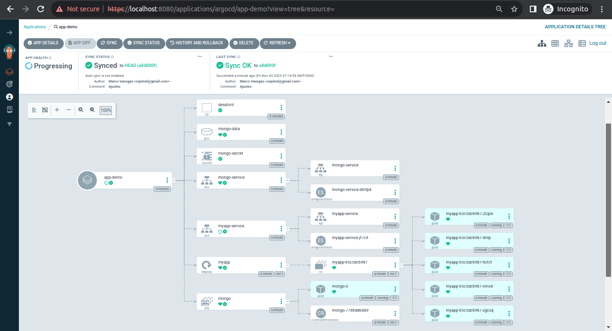

# Argo CD - Desafío 9

### Entregables

1. Manifiesto de kubernetes que se aplicará en el cluster, puede ser el deploy de un pod con una imagen.
2. Documento con instrucciones de cómo se realizó el desafío (de ser posible adjuntar capturas de pantalla).

### Consejos

Se recomienda el uso de Argo CD pero se pueden utilizar otras herramientas, así también se recomienda no automatizar el sync de Argo para tener un poco más de control sobre cuando aplicamos los cambios en nuestras aplicaciones.

### Solución

1. Se inicializa el servicio *docker-desktop* con el comando `systemctl --user start docker-desktop`, e igualmente se inicia sesión con `docker login`.

2. Se inicia minikube `minikube start`.

3. Se crea el namespace de Argo CD `kubectl create ns argocd` y luego se ejecuta `kubectl apply -n argocd -f https://raw.githubusercontent.com/argoproj/argo-cd/stable/manifests/install.yaml`.

4. Se genera la clave para ingresar a la consola de Argo CD mediante el comando `kubectl -n argocd get secret argocd-initial-admin-secret -o jsonpath="{.data.password}" | base64 -d`.

5. Se ejecuta el comando `kubectl port-forward svc/argocd-server -n argocd 8080:443` que permite acceder a la consola de Argo CD mediante el navegador.

6. Se ingresa a la consola de Argo CD con el usuario `admin` y la contraseña generada en el paso 4.

7. Se ejecuta `kubectl apply -f my-app.yaml` para crear la app en Argo CD. Este manifiesto, contiene el namespace **argocd** para que el objeto pueda ser visualizado en la consola de Argo CD. A continuación, se valida su creación mediante el comando `kubectl get apps -n argocd`, y la visualización del proceso en la consola de Argo CD.

8. Se dá clic en SYNC y luego en SYNCHRONIZE en el modal para ejecutar los manifiestos del repositorio de GitHub relacionado en *my-app.yaml* del paso 7.

9. Se valida la creación de los pods mediante el comando `kubectl get pods -n desafio9`, e igualmente se valida en la consola de Argo CD.

10. Se ejecuta el comando `kubectl port-forward svc/myapp-service -n desafio9 3000:3000` para acceder a la app desde el navegador, y posteriormente se valida el funcionamiento de la aplicación, para ello se ingresa a http://localhost:3000/crear, se recarga la página 5 veces (F5) y luego se valida la creación de los registros en la url http://localhost:3000.

### Presentación PDF

[Solución Desafio 9 - Marco Vanegas.pdf](Solución_Desafio_9_-_Marco_Vanegas.pdf).